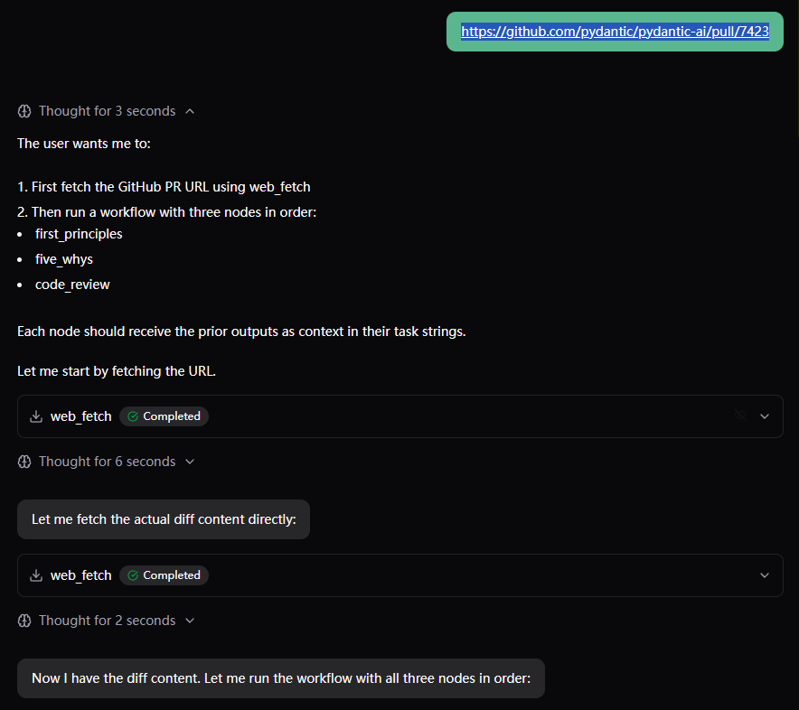
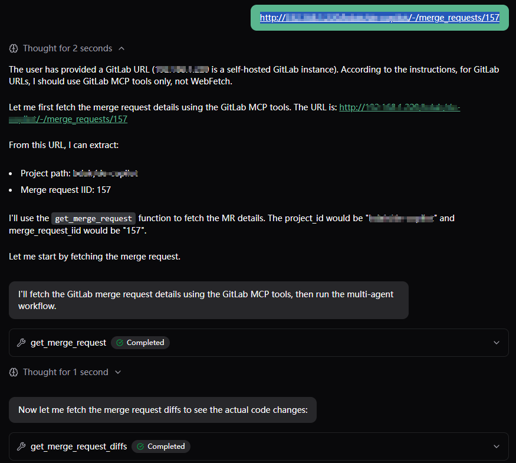
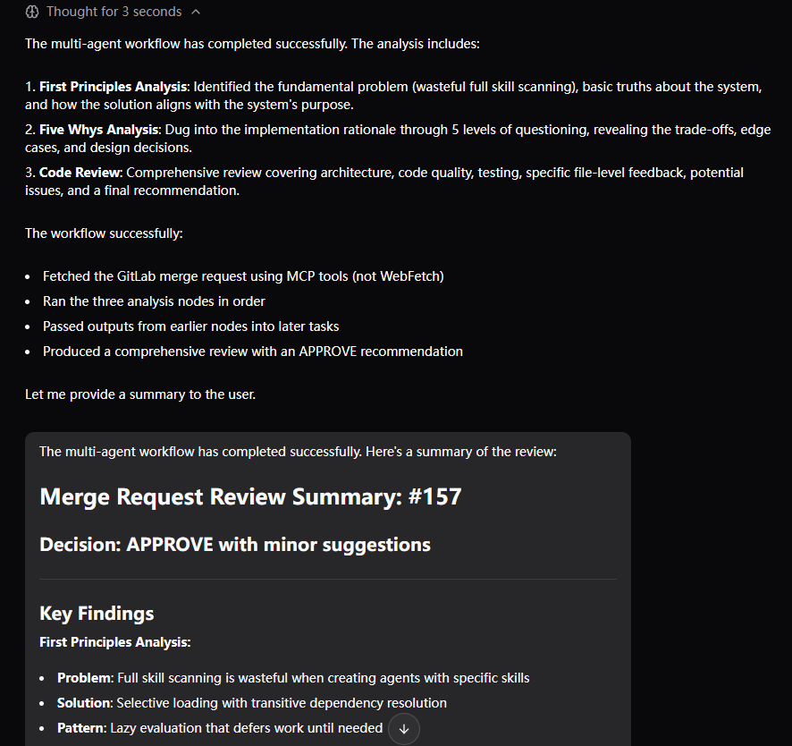

# agent-playbook

[中文](README_CN.md) | [English](README.md)

agent-playbook 是基于 pydantic-ai DynamicWorkflow 与 Agent Skills 的 YAML 多智能体工作流。

## 功能

- Playbook 配置位于 [`.agents/`](.agents/)，基于 [pydantic-ai](https://ai.pydantic.dev/) + [pydantic-ai-harness](https://github.com/pydantic/pydantic-ai-harness) `DynamicWorkflow`
- 每个节点配置 `instructions` 与可选 `skills`（通过 [pydantic-ai-skills](https://github.com/DougTrajano/pydantic-ai-skills) 从 `.agents/skills/` 加载）
- 内置 `codereview`：拉取 GitHub / GitLab 的 commit、PR/MR，再按第一性原理 → 5-whys → 代码评审执行
- GitHub 使用 WebFetch；配置 `GITLAB_API_URL` 后，GitLab 走 [mcp-gitlab](https://github.com/zereight/gitlab-mcp)
- 通过 `agent.to_web()` 提供 Web 聊天界面

## 安装

Python 3.10+，依赖管理使用 [uv](https://docs.astral.sh/uv/)：

```bash
git clone --recurse-submodules https://github.com/lhp0630/agent-playbook.git && cd agent-playbook
uv sync --all-groups
```

若已克隆但未拉取子模块：

```bash
git submodule update --init --recursive
```

技能包位于 `.agents/skills/`（`first-principles-skill`、`5-whys-skill`、`code-review-skill`）。

## 快速开始

复制 `.env.example` 为 `.env`，填入凭证：

```bash
OPENAI_MODEL=your-model-name
OPENAI_BASE_URL=https://your-api-endpoint/v1
OPENAI_API_KEY=sk-xxx

# 可选 — 启用 GitLab MCP，用于 GitLab 地址
GITLAB_API_URL=https://gitlab.example.com/api/v4
GITLAB_PERSONAL_ACCESS_TOKEN=glpat-xxx
```

运行 Playbook（`-n` 须与 YAML 中的 `name` 一致；省略则随机选择）。粘贴 GitHub commit `.diff` / PR，或 GitLab commit / MR 地址：

```bash
agent -n codereview
```

可选监听地址（默认 `127.0.0.1:8000`）：

```bash
agent -n codereview --host 127.0.0.1 --port 8000
```

## Playbook 结构

```yaml
name: "codereview"
description: "Review a GitHub/GitLab commit or PR/MR"
model:
  temperature: 0.3
instructions: |
  GitHub → WebFetch。GitLab → gitlab MCP（不要对 GitLab 使用 WebFetch）。
nodes:
  - name: first_principles
    instructions: |
      Load and apply the first-principles-skill. ...
    skills:
      - first-principles-skill
```

## 示例

```bash
agent -n codereview
```

| GitHub | GitLab | 结果 |
| --- | --- | --- |
|  |  |  |
